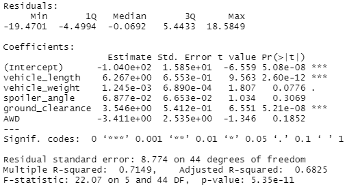
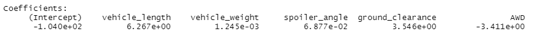
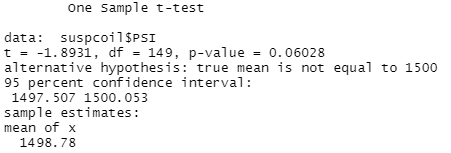
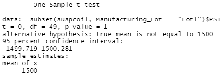
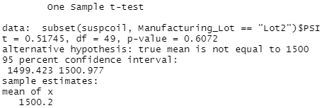
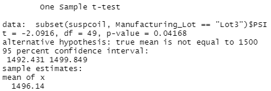

# MechaCar_Statistical_Analysis

## Linear Regression to Predict MPG
#### The variables that provided a non-random amount of variance to the mpg values in the dataset are vehicle length and ground clearance. The intercept is also statistically significant.

#### This linear model predicts the mpg of MechaCar prototypes effectively because the p-value is 5.35e-11, which is less than 0.05.

#### The slope of the linear model is not considered zero because the coefficients of the variables are not zero.

## Summary Statistics of Suspension Coils
The manufacturing data shows that the variance of the suspension coils does not exceed 100 pounds per square inch when looking at all the manufacturing lots in total.

However, the manufacturing data of each lot individually shows that while Lots 1 and 2 meets the design specifications and both have variances less than 100 pounds per square inch(0.9795918 and 7.4693878 respectively), Lot 3 does not, with a variance of 170.2861224 pounds per square inch.

## T-Tests on Suspension Coils
#### T-test: Ho: mu = 1500
#### Ha: mu ≠ 1500

#### All lots: There is not sufficient evidence to to reject the null hypothesis. The two means are statistically similar

#### Lot 1: There is not sufficient evidence to to reject the null hypothesis. The two means are statistically similar

#### Lot 2: There is not sufficient evidence to to reject the null hypothesis. The two means are statistically similar

#### Lot 3: There is sufficient evidence to to reject the null hypothesis. The two means are statistically different.

## Study Design: MechaCar vs Competition
 - A metric that can be tested is if maintenance cost has a significant impact on mpg.
 - The null hypothesis would be that all coefficients in the model are zero and none of the predictor variables have a statistically significant relationship with mpg. The alternative hypothesis would be that not every coefficient in the model is zero and at least one of the predictor variables has a statistically significant relationship with mpg.
 - A multiple linear regression would need to be performed.
 - Data on maintenance cost on vehicles would need to be randomly collected. The sample size would need to be reasonably large.
